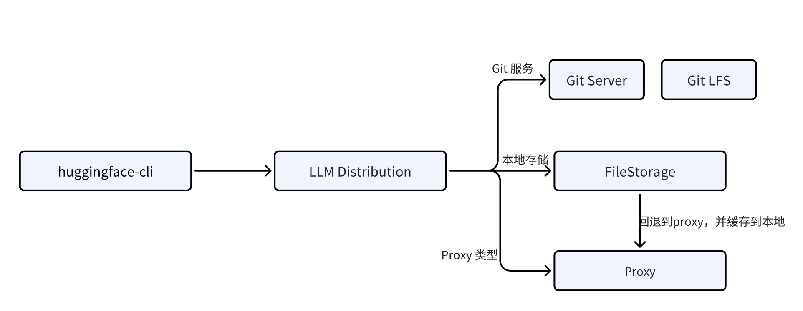

# LLM Distribution

A server for distributing Large Language Model (LLM) requests to different storage systems, with an API compatible with the Hugging Face Hub API.



# Architecture

## Features

- [x] Local storage, when local storage is not found, it will fallback to proxy to Hugging Face Hub
- [ ] Git storage
- [x] Proxy to Hugging Face Hub


## Usage

```
$ go run cmd/llmdistribution/main.go
$ export HF_ENDPOINT=http://localhost:8081
$ huggingface-cli download facebook/opt-125m
```